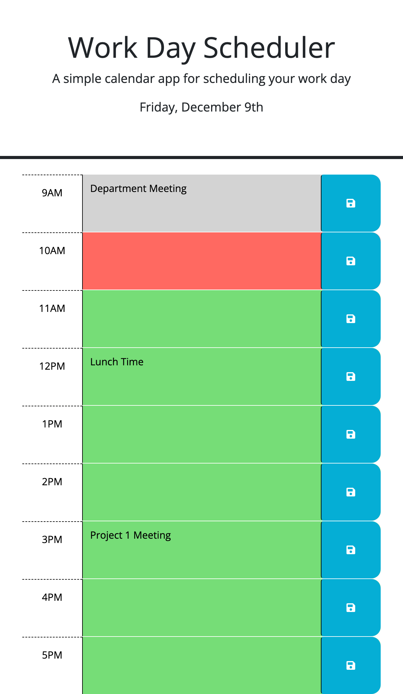

# Module 05 Challenge - Work Day Scheduler

>**Application Link:** [Work Day Scheduler](https://fannychen623.github.io/Challenge-05-Work-Day-Scheduler/)
>
>**View:** [Description](#description) / [Application Details](#application-details) / [Application Sample Video](#application-sample-video) / [Responsive Layout Example](#responsive-layout)
>
>**Site Preview:**
>
>
## **DESCRIPTION**
> Topic Assessed: **Third-Party APIs** - **Bootstrap, jQuery, day.js, etc.**
### **My Task**
*Work Day Scheduler* allows a user to save events for each standard business hour of the day.
> Modify existing starter code. 
>
> Update HTML using bootstrap to create time blocks of standard business hours.
> 
> Add JavaScript and JQuery to save events to the local storage and render the events when the page is initialized.
> 
> Display the current date and color-code the time blocks by combining the use of the day.js library in the script.
> 
## User Story
```
AS AN employee with a busy schedule
I WANT to add important events to a daily planner
SO THAT I can manage my time effectively
```

## Acceptance Criteria

```
GIVEN I am using a daily planner to create a schedule
WHEN I open the planner
THEN the current day is displayed at the top of the calendar
WHEN I scroll down
THEN I am presented with timeblocks for standard business hours
WHEN I view the timeblocks for that day
THEN each timeblock is color coded to indicate whether it is in the past, present, or future
WHEN I click into a timeblock
THEN I can enter an event
WHEN I click the save button for that timeblock
THEN the text for that event is saved in local storage
WHEN I refresh the page
THEN the saved events persist
```

## **APPLICATION DETAILS**

### HTML Information
* **Head**: Added a `reset.css` file.
* **Semantic Elements**: Renamed first `<div>` tags to `<main>` for a more indicative element.
* **Bootstrap**: Duplicate bootstrap timeblocks for standard business hours.
  * The id of each time block starts with the prefix "hour-" and ends with the hour (24 hour clock format).
  * The text in the first column of the time block is the hour (12 hour clock format) followed by AM/PM. It is ordered from 9AM to 5PM (total of 9 time blocks).
* **Files**: Moved CSS and JavaScript files into assets folder for path clarity/organization. 
* **Comments**: Added indicative comments before each section.

### CSS Information
* **Comments**: Added indicative comments before selectors.

### JavaScript Information
* **$(function () {code})**: Wrap all code that interacts with the DOM in a call to jQuery to ensure that the code isn't run until the browser has finished rendering all the elements in the html.
* Define an empty array of `scheduledEvents` to be used to store existing and new events.
* **Render Local Storage**: Get and define the array of events from the local storage.
  * Define `storedEvents` as `JSON.parse(localStorage.getItem("scheduledEvents")` to render events from the local storage.
  * If the `storedEvents` is not undefined/null, then define it as `scheduledEvents` to be used in populating the time block textareas.
* **Display Current Date**: Use day.js to get the current day and display it in the header.
  * Use a function to determine the ordinal (i.e. st, nd, rd, th) of the day of the month.
    * **Referenced Code**: [JavaScript new Date Ordinal (st, nd, rd, th)](https://stackoverflow.com/questions/15397372/javascript-new-date-ordinal-st-nd-rd-th)
  * Call the ordinal function with the day value and define the returned value as `Do`.
    * Define the day value with day.js by using `Number(dayjs().format('d'))`.
      * Use `format('d')` to return only the day value of the date of the local device.
      * Use  `Number` to ensure that the value returned is recognized as a number value.
  * Use jQuery to append the current date into the html header.
    * Define the location (`id=currentDay`) of the html to enter the text with `$('#currentDay').text()`.
    * Use day.js to get and format the current day: `(dayjs().format('dddd[,] MMMM D')) + Do`
      * `dddd` = full name of the day of the week, `MMMM` = full name of the month, `D` = day of the month.
        * **Source**: [Day.js Display Format](https://day.js.org/docs/en/display/format)
      * Use brackets to enter string between the days ([,]).
      * Add `Do` at the end for the ordinal of the day value.
* **Color-code and Populate Time Blocks**: Use day.js, combined with jQuery to get the current hour to color-code and populate the time blocks.
  * Define the day value with day.js by using `Number(dayjs().format('H'))`.
      * Use `format('H')` to return only the hour value (24 hour clock format) of the date of the local device.
      * Use  `Number` to ensure that the value returned is recognized as a number value.
  * Loop through all sections with the class `time-blocks` with jQuery `$('.time-block').each(function() {})`
    * Find the id of the current block and remove the prefix "hour-" so that only the ending hour (24 hour clock format) remains.
      * Use the `replace` method to remove the prefix.
    * Check if the hour of the current block is less than, greater than, or equal to the current hour.
      * If it is less than the current hour, add the class `past` to the current block.
      * If it is equal to the current hour, add the class `present` to the current block.
      * If it is greater than the current hour, add the class `future` to the current block.
      * The new class correspond to colors defined in the css which would color-code the time blocks.
    * Initialize to empty array called `eventItem` in the case where `scheduledEvents` is undefined/empty.
      * This is to prevent the error `Cannot read Property '0' of Undefined`.
    * Populate the child element of this time block that is a textarea element with the stored event for this hour.
      * Define the index of the array as `idHour-9` to get an index starting at 0 from the hour of the time block.
      * Use jQuery to locate the child element that is a textarea, `$(this).children('textarea').val()`, to populate with the stored event.
* **$('.saveBtn').on('click', function () {code})**: jQuery listener for click events on the save button.
  * Define the index of the time block.
    * Find the id of the parent element (in the format "hour-**").
    * Replace the "hour-" prefix with blank "" to return only the hour value (24 hour format).
    * Subtract 9 from the value to get the index of an array, starting at an index of 0.
  * Replace the value of the defined index in the `scheduledEvents` array with the textarea value.
    * Find the closest `time-block` class and find its' child element that is a textarea element.
    * Replace the index value in the array `scheduledEvents` with the textarea value.
  * Set the array item in the local storage and covert it as a string with `JSON.stringify`.

## **APPLICATION SAMPLE VIDEO**
### Sample Video
>

## **RESPONSIVE LAYOUT**
### Screen Size: 650px
>